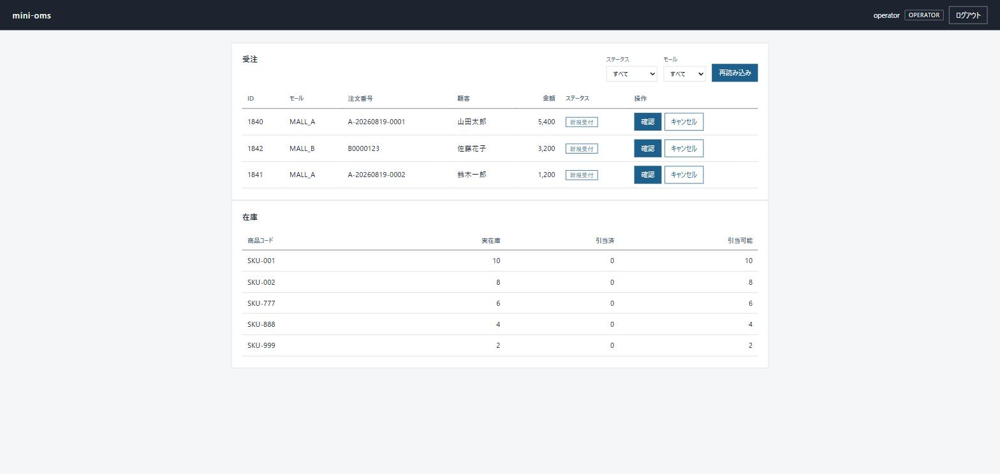
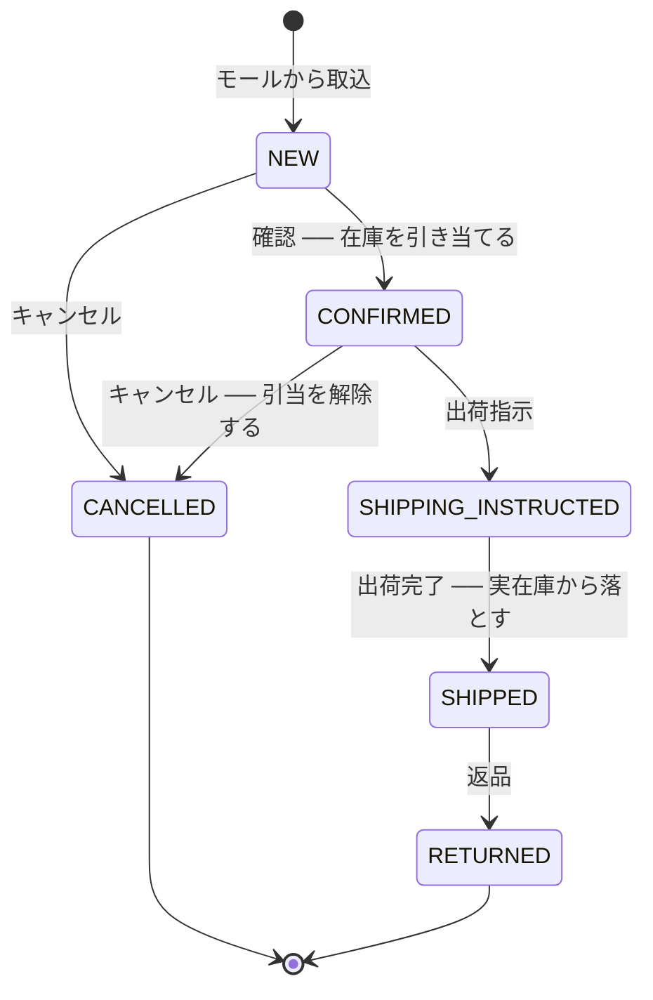

# multimall-oms — マルチモール受注統合ミニOMS

複数のECモールから受注を取り込み、ステータス管理・在庫引当・出荷確定までを行う受注管理システム(OMS)です。
モールごとに異なるAPI形式(JSON / XML)を吸収し、受注のライフサイクルと在庫を破綻なく回すことを目的にしています。

**このリポジトリは「動くこと」より「なぜそう作ったか」を読めることを重視しています。**

---

## このリポジトリの読み方

設計意図を4つの場所に分けて書いています。

| 場所 | 表現するもの |
|---|---|
| コード | **How** — 実装の詳細 |
| テスト | **What** — 仕様。テスト名とアサーションを読めば業務ルールが分かる |
| コミットメッセージ | **Why** — なぜこの変更をしたか。業務背景・設計判断 |
| コメント | **Why not** — なぜ他の選択肢を採らなかったか |

テストメソッド名は日本語です。`出荷指示済みの受注はキャンセルできない()` のように、
テスト一覧がそのまま業務仕様書として読めることを優先しています。

`git log` を追うと、各機能をなぜその形にしたかが順に読めます。

---

## 動かす

必要なもの: Docker / JDK 21

```bash
docker compose up -d      # PostgreSQL 16 を起動
./gradlew bootRun         # アプリ起動(Flyway がスキーマと初期データを作成)
```

起動すると 1分ごとにモックモールAPIから受注を取り込みます。

```
受注取込完了: 取込3件 スキップ0件 失敗0件 取得失敗モール[]
受注取込完了: 取込0件 スキップ3件 失敗0件 取得失敗モール[]   ← 2回目は冪等キーで全件スキップ
```

起動したら **http://localhost:8080/** を開くとオペレーター画面が出ます。



操作ボタンは受注ごとのステータスから決まり、押すと在庫の行がその場で動きます。
`viewer` でログインすると操作欄は「参照のみ」になります。

### ログインする

画面を使わずAPIを直接叩く場合も、認証が必要です。ローカルデモ用の利用者が起動時に作られます。

| ユーザー名 | パスワード | ロール | できること |
|---|---|---|---|
| `operator` | `operator-pass` | OPERATOR | 参照 + 受注と在庫を動かす操作 |
| `viewer` | `viewer-pass` | VIEWER | 参照のみ |

```bash
TOKEN=$(curl -s -X POST "http://localhost:8080/api/auth/login" \
     -H "Content-Type: application/json" \
     -d '{"username":"operator","password":"operator-pass"}' \
  | sed 's/.*"accessToken":"\([^"]*\)".*/\1/')
```

このアカウントは `mock` プロファイル(ローカル既定)でのみ作られます。

### 一連の業務フローを試す

```bash
# 受注一覧(未確認のものを古い順に)
curl "http://localhost:8080/api/orders?status=NEW" -H "Authorization: Bearer $TOKEN"

# 在庫の初期状態
curl "http://localhost:8080/api/stocks" -H "Authorization: Bearer $TOKEN"

# 確認 → 在庫が引き当てられる(実在庫は減らない)
curl -X POST "http://localhost:8080/api/orders/1/confirmation" \
     -H "Authorization: Bearer $TOKEN" \
     -H "Content-Type: application/json" -d '{"version":0}'

# 出荷指示 → 在庫は動かない
curl -X POST "http://localhost:8080/api/orders/1/shipping-instruction" \
     -H "Authorization: Bearer $TOKEN" \
     -H "Content-Type: application/json" -d '{"version":1}'

# 出荷完了 → 引当が実在庫から落ちる
curl -X POST "http://localhost:8080/api/orders/1/shipment" \
     -H "Authorization: Bearer $TOKEN" \
     -H "Content-Type: application/json" -d '{"version":2}'
```

`viewer` のトークンで更新系を叩くと、業務ロジックに届く前に弾かれます。

```
$ curl -X POST .../api/orders/1/confirmation -H "Authorization: Bearer $VIEWER_TOKEN" -d '{"version":0}'
403 {"title":"権限がありません","detail":"この操作を行う権限がありません"}
```

在庫の動きは `GET /api/stocks` で追えます。

```
確認    実10 引2 可8     ← 引当。実在庫は減らない
出荷指示 実10 引2 可8     ← 在庫は動かない
出荷完了 実 8 引0 可8     ← 引当が実在庫から落ちる
キャンセル(確認済から)     ← 引当が戻る
```

> PowerShell では `curl` が `Invoke-WebRequest` のエイリアスのため、`curl.exe` を使い
> ボディは `-d "{\"version\":0}"` のようにエスケープしてください。

---

## 何ができるか

### 受注の取込

2つのモール(モックAPI)から定期的に受注を取り込みます。形式は意図的に揃えていません。

| | モールA | モールB |
|---|---|---|
| 形式 | JSON | XML |
| 日時 | ISO-8601 (`2026-08-19T10:00:00+09:00`) | 独自形式・TZなし (`20260819103000`) |
| ステータス | なし | 独自コード (`01`/`03`/`09`...) |

この差異はモールごとのクライアント(腐敗防止層)が吸収し、上位層にはドメインの受注だけが渡ります。

### 受注のライフサイクル



出荷指示後はキャンセルできません。倉庫で既にピッキングが走っている可能性があり、
システム上だけキャンセルすると実在庫と引当の不整合を生むためです
(実務では「出荷指示取消」という別フローで対応します。本デモではスコープ外)。

### API

| メソッド | パス | 用途 | 必要な権限 |
|---|---|---|---|
| POST | `/api/auth/login` | ログイン(アクセストークン発行) | 不要 |
| GET | `/api/orders?status=&mallCode=&page=&size=` | 受注一覧(注文日時の古い順) | VIEWER / OPERATOR |
| GET | `/api/orders/statuses` | ステータスの一覧(絞り込みの選択肢) | VIEWER / OPERATOR |
| GET | `/api/orders/{id}` | 受注詳細(明細つき) | VIEWER / OPERATOR |
| POST | `/api/orders/{id}/confirmation` | 確認(在庫引当) | OPERATOR |
| POST | `/api/orders/{id}/shipping-instruction` | 出荷指示 | OPERATOR |
| POST | `/api/orders/{id}/shipment` | 出荷完了(実在庫から落とす) | OPERATOR |
| POST | `/api/orders/{id}/cancellation` | キャンセル(引当解除) | OPERATOR |
| POST | `/api/orders/{id}/return` | 返品 | OPERATOR |
| GET | `/api/stocks` | 在庫一覧(実在庫・引当済・引当可能数) | VIEWER / OPERATOR |
| GET | `/mock/mall-a/orders` | モールAのモック(JSON) | 不要 |
| GET | `/mock/mall-b/orderList` | モールBのモック(XML) | 不要 |
| GET | `/` | オペレーター画面(静的ファイル) | 不要 |

更新系は対象受注の `version` を必須で受け取ります(後述)。

---

## 設計上の判断

### 業務ルールはドメイン層だけに置く

```
presentation → application → domain
                    ↑
              infrastructure       (application のインターフェースを実装する)
```

`infrastructure` は `application` が定義したポート(`OrderRepository`、`MallOrderClient`、
`StockRepository`、`TransactionRunner`)を実装します。依存は常に内側を向きます。

`domain` と `application` はフレームワークに依存しません。ユースケースはコンストラクタで
組み立てられる素のクラスで、Bean定義は `infrastructure` 側に置いています。
そのおかげでユースケースのテストはDIコンテナの起動を必要とせず、一瞬で回ります。

### 状態遷移は状態機械が唯一の真実

遷移可否の判定は `OrderStatus` の1箇所にしかありません。Controller にもサービスにも
「このステータスなら…」という分岐を置かないことで、判定ロジックの二重化を防いでいます。

在庫への影響も同じ考え方で、遷移の組み合わせを列挙せず
「その状態が引当を抱えているか」という性質から導いています。

```java
public StockEffect stockEffectOf(OrderStatus target) {
    if (!holdsStockAllocation() && target.holdsStockAllocation()) return StockEffect.ALLOCATE;
    if (holdsStockAllocation() && !target.holdsStockAllocation()) {
        return target == SHIPPED ? StockEffect.SHIP_OUT : StockEffect.RELEASE;
    }
    return StockEffect.NONE;
}
```

遷移を1本追加するたびに在庫側の対応表を書き足す形にすると、書き漏らしたときに在庫だけが狂います。

### 冪等キーはDB制約を最終防衛線にする

`(mall_id, mall_order_number)` にユニーク制約を張り、取込処理はこの制約違反を
**正常系(既に取込済みのためスキップ)** として扱います。

取込は「前回より長く遡って取得し、重複は弾かせる」方式です。前回実行時刻を保存する
差分取得は、実行失敗時や複数インスタンス運用で「どこまで取得済みか」の管理が破綻しやすく、
取りこぼしより重複を選ぶ方が壊れにくいと判断しました。

アプリ側の存在チェックだけに頼らないのは、バッチ多重起動時にチェックとINSERTの間へ
別プロセスが割り込みうるためです。

### 楽観ロックと悲観ロックを使い分ける

| | 受注 | 在庫 |
|---|---|---|
| 方式 | **楽観ロック**(version) | **悲観ロック**(`SELECT ... FOR UPDATE`) |
| 理由 | 同じ受注を2人が同時に触るのは稀。競合したら操作を失敗させ、画面を更新させる方が安全 | 同一商品への同時更新が構造的に多い。競合のたびに失敗させると呼び出し側に再試行の責任が生まれる |

受注の更新系APIは、クライアントが表示していた `version` を必須で受け取ります。
省略を許すと「今のDBの状態に無条件で適用する」意味になり、楽観ロックが機能しなくなるためです。
古い `version` での操作は `409 Conflict` で弾かれます。

在庫の引当は**商品コード順**にロックを取ります。複数の受注が同じ商品群を同時に処理しても
ロック順が揃うため、互いのロックを待ち合うデッドロックを避けられます。

### 受注の更新と在庫の反映は一体で成立させる

「確認済だが在庫は押さえられていない」「引当済だが受注は未確認」という状態は、
実在庫と帳簿の食い違いに直結します。両者は必ず同一トランザクションで行います。

ただし `application` をフレームワーク非依存に保つため、`@Transactional` ではなく
`TransactionRunner` ポートとして境界を宣言し、Spring への依存は実装側に閉じています。

在庫不足で引当に失敗すると、受注のステータス更新ごと巻き戻ります。

```
$ curl -X POST .../api/orders/2/confirmation -d '{"version":0}'
409 {"title":"処理できない要求です","detail":"在庫が不足しています: 商品=SKU-002 要求=2 引当可能=1"}

→ 受注2 は NEW のまま / SKU-002 の引当済も 0 のまま
```

### 在庫は2つの数で持つ

在庫は「実在庫(倉庫にある数)」と「引当済(出荷が約束された数)」を持ち、
引当可能数は保存せず両者から導出します。3つ持つと片方だけ更新された不整合が起きうるためです。

引当は倉庫からモノを出す操作ではないので実在庫を減らしません。出荷して初めて減ります。
この区別が崩れると、売れる数を読み違えて欠品か二重売りを起こします。

### 一覧に集約を返さない

受注一覧は `Order` 集約ではなく、表示に必要な列だけを持つ読み取りモデルを返します。
集約は明細を必ず伴うため、一覧で復元すると画面に出さない明細のロードが件数分走ります。
参照用ポート(`OrderSearchQuery`)を更新用ポート(`OrderRepository`)と分け、
読み書きの非対称を型として残しています。

### 画面に業務ルールを持たせない

オペレーター画面は静的ファイル3枚(html/css/js)で、フレームワークもビルド環境も
使っていません。画面そのものは成果物ではなく、主要フローを触れるようにするための器です。

重要なのは、**画面が遷移ルールを知らない**ことです。

```json
// GET /api/orders の1行
{ "id": 2, "status": "CONFIRMED", "version": 1,
  "availableActions": [
    { "operation": "shipping-instruction", "label": "出荷指示" },
    { "operation": "cancellation",         "label": "キャンセル" }
  ] }
```

画面は `availableActions` をボタンとして並べるだけです。「NEWなら確認とキャンセル」という
対応表を画面が持つと遷移ルールが二重化し、遷移を1本追加したときに画面だけ古いまま残ります。
`OrderStatus` が唯一の真実である状態を、画面を足しても崩さないための形です。

同じ理由で、**ステータスの表示名もサーバーが返します**。値は enum 名のままで、
人に見せる文字列だけを `statusLabel` として添えます。

| | 値 | 表示 |
|---|---|---|
| 用途 | 絞り込み、スタイルの出し分け | 人が読む |
| 例 | `SHIPPING_INSTRUCTED` | 出荷指示済 |

表示名を値として送ってしまうと、言い回しを変えただけでクライアントの分岐が壊れます。
逆に対応表を画面側に置くと、ステータスを追加したときに画面だけ enum 名を素で表示します。
絞り込みの選択肢も `GET /api/orders/statuses` から取るので、画面はステータスの一覧を知りません。

表示名を `OrderStatus` 自体に持たせないのは、どう呼ぶかは画面の都合で変わる一方、
ステータスそのものは業務の構造であり、**変わる理由が違う**ためです。

権限による出し分けにはログイン応答の `role` を使います。トークンを画面側で復号して
読む形にすると、画面が自分の権限を自称する経路になるためです。
ただし**ボタンを隠すことは防御ではありません**。操作を許すかどうかは毎回サーバーが判断し、
VIEWER が直接APIを叩けば 403 で弾かれます。

### 認証はトークン、認可はURLで判断する

ログインAPIで資格情報を検証し、署名付きトークン(JWT)を発行します。以降のリクエストは
トークンだけで認証され、サーバーはセッションを持ちません。

| | 選択 | 理由 |
|---|---|---|
| 資格情報の運び方 | トークン(Bearer) | 毎リクエストでパスワードを送らずに済む。BCrypt照合はログイン時の1回だけ |
| 署名 | 共通鍵(HS256) | 発行するのも検証するのもこのアプリ1つ。鍵を配る相手がいない |
| 署名鍵の出どころ | 環境変数 | 未設定なら起動ごとに生成。リポジトリに鍵を残さない |
| 失効 | 有効期限のみ(既定1時間) | 失効リストを持つとステートレスの前提が崩れ、検証のたびにDB参照が必要になる |
| 試行制限 | 5回失敗で1分間ロック | ハッシュ化は総当たりを遅くするだけで止めはしない |

ログインの試行制限には、正解の無い判断が2つあります。

- **恒久ロックにしない** — 解けない仕様だと、他人のユーザー名を叩き続けるだけで
  その人を締め出せます。一定時間で自動的に解ける形にして、目的を「速度を落とすこと」に絞りました
- **存在しないユーザー名も同じように数える** — 実在する利用者だけを数えると、
  ロックされるかどうかでユーザー名の実在を判定できてしまいます

記録はメモリに持ちます。複数インスタンス運用なら共有ストアが要りますが、
単一インスタンス構成のうちは依存を増やす段階ではないと判断しました
(分散させる時点でポート化して差し替えます)。

トークンの発行と検証は自前で組まず、Spring Security(Nimbus)に任せています。
手書きのJWT実装は `alg=none` の受理や期限の検証漏れといった穴を踏みやすく、
**失敗しても認証が素通りするだけで気づけない**種類の不具合になるためです。

ログアウトAPIは用意していません。サーバー側に状態を持たない以上、「失効させた」と
応答しても実際には期限まで有効です。できないことをAPIとして見せる方が危険と判断し、
代わりに寿命を短く保つ設定を明示しています。

#### 認可はドメイン層に置かない

権限は「見るだけの人(VIEWER)」と「動かす人(OPERATOR)」の1本の線だけです。
このルールは `SecurityConfig` にあり、ドメイン層にはありません。

| ルール | 置き場所 | なぜ |
|---|---|---|
| 出荷指示済みの受注はキャンセルできない | domain (`OrderStatus`) | 受注そのものの性質。誰が操作しても変わらない |
| VIEWER はキャンセルAPIを叩けない | presentation (`SecurityConfig`) | 誰に操作を任せるかという運用の取り決め。組織で変わる |

「業務ルールは必ず domain 層に置く」という方針を持っていますが、認可はそこに含めません。
**変わる理由が違うものを同居させない**ためです。

### エラーの表現

業務ルール違反は `DomainException` のサブクラスで表し、HTTPステータスへの変換は
presentation 層の1箇所(`ApiExceptionHandler`)に集約しています。
例外クラスに `@ResponseStatus` を付けるとドメイン層がSpring MVCに依存するため採っていません。

| 状況 | ステータス |
|---|---|
| リクエストの形式・値が不正 | 400 |
| 誰であるかを確認できない(トークンが無い・期限切れ・署名が不正・資格情報が誤り) | 401 |
| 誰かは分かるが、その操作を任されていない | 403 |
| ログインの試行が続けて失敗し、しばらく受け付けない | 429 |
| 受注が存在しない | 404 |
| 要求は正しいが受注の現在状態と衝突(不正な遷移・在庫不足・同時更新) | 409 |

400と409を分けているのは、後者が**同じ要求でも状態次第で成功しうる**ためです。
401と403を分けているのは、前者が**やり直せる**(ログインし直せばよい)のに対し、
後者は**何度やっても通らない**ためです。

セキュリティフィルタで弾かれた応答も同じ ProblemDetail 形式で返します。
Spring Security の既定は本文が空で、クライアントがエラーの読み取り方を
2通り持つことになるためです。

---

## テスト

```bash
./gradlew test     # Docker が必要(Testcontainers が実PostgreSQLを起動します)
```

| 層 | 方針 |
|---|---|
| domain | Springコンテキスト不要の単体テスト。最速で回る |
| application | ユースケースの仕様。テストダブルは手書きのFake |
| infrastructure | **Testcontainers で実PostgreSQL**を使う |
| presentation | `@WebMvcTest` でHTTP契約(ステータスコード・JSON)を固定 |

認可のテストだけは認証をモックで差し替えず、ログインAPIから取った本物のトークンを使います。
クレーム名や権限の接頭辞の食い違いは最も起きやすい設定ミスで、
モックで代用すると**そこだけ素通りして本番で全員が弾かれる**からです。

### E2E は2本、担当が違う

どちらも実サーバを起動し、認証もモールAPIもモックに差し替えません。
各層のテストが通っていても繋いだときに噛み合わないことがあり、
それは通しで動かして初めて確認できるためです。

| | `OrderFlowEndToEndTest` | `OperatorScreenEndToEndTest` |
|---|---|---|
| 通す経路 | **サーバー内** (HTTP) | **画面から** (Chromium) |
| 確認すること | 取込・冪等性・認可・在庫の増減 | ボタンの出し分け・再描画・権限による表示 |
| ある理由 | 取込は画面から起動できない | 画面とAPIの繋ぎ違いはHTTPだけでは捕まらない |

```
サーバー内:  取込(モールA JSON 2件 + モールB XML 1件)
              → ログイン → VIEWER で出荷指示 → 403
              → OPERATOR で確認 → 実6 引2 可4 → 出荷指示 → 出荷完了 → 実4 引0 可4
              → 再取込 → 3件すべてスキップ

画面から:    ログイン → [確認] を押す → バッジが「確認済」/ 在庫の行が 実6 引2 可4
              → [出荷指示] → キャンセルボタンが消える / 在庫は動かない
              → [出荷完了] → 実4 引0 可4
```

画面E2Eが押せるボタンを確かめているのは、**画面が遷移ルールを持っていないこと**の
裏取りです。画面側に対応表があれば、遷移を追加したときにテストが古いまま通ってしまいます。

Playwright は Chromium だけを使います。既定では Firefox と WebKit まで入って
1GB近くを消費するため、`./gradlew test` が必要なものだけを取得します
(初回はブラウザの取得で数十秒かかります)。

### H2 での代用を禁止している理由

インメモリDBは制約違反時の例外や型の丸めが実DBと異なり、
**「テストは通るが本番で壊れる」**状態を作ります。

このリポジトリでは、次のような実DBでしか確認できない挙動をテストで固定しています。

- ユニーク制約違反が `DataIntegrityViolationException` として上がること(冪等キー)
- `CHECK` 制約が「引当済 > 実在庫」の在庫を拒否すること
- `CHECK` 制約が未知のロールを拒否すること(綴り間違いが認可の穴にならない)
- `TIMESTAMPTZ` / `NUMERIC` がJavaの型と往復すること
- 在庫不足時に**トランザクションが実際に巻き戻る**こと

カバレッジ目標は設けていません。「テストを読めば仕様が分かる」ことを優先しています。

---

## 技術スタック

- Java 21 / Spring Boot 3.5(Web, Data JPA, Security, OAuth2 Resource Server, Validation)
- PostgreSQL 16 + Flyway
- Gradle (Kotlin DSL)
- JUnit 5 / AssertJ / Testcontainers / Playwright
- GitHub Actions(push と Pull Request でテストを実行)

---

## 現在の状態

実装済み:

- モールA/Bからの受注取込(定期実行・冪等)
- 受注のライフサイクル管理(確認・出荷指示・出荷完了・キャンセル・返品)
- 在庫引当(引当・解除・出荷確定、悲観ロック、トランザクション境界)
- 受注・在庫の参照API
- 認証(JWT)と認可(OPERATOR / VIEWER の2ロール)
- E2Eテスト(サーバー内の通し1本 + 実ブラウザでの画面操作1本)
- オペレーター画面(受注の一覧と操作、在庫の確認)

スコープ外と決めたもの:

- **利用者の登録・変更API** — 利用者管理はこのシステムの主題ではなく、
  作れば権限昇格という別の攻撃面を抱え込みます。デモ用の利用者は起動時に投入しています。
- **トークンの即時失効** — 失効リストを持つとステートレスの前提が崩れるため、
  寿命を短く保つ割り切りを設定として明示しています。

---

## ライセンス

MIT License。詳細は [LICENSE](LICENSE) を参照してください。

---

## やらないこと(スコープ外)

- 実在モールのAPI仕様の模倣・転載はしません。モックは「モールA(JSON)」「モールB(XML+独自ステータスコード)」と抽象化しています
- 決済連携、配送業者API連携は作りません
- 管理画面は主要フローを触れる最小の1画面までです。フロントエンドのフレームワークと
  ビルド環境は導入していません(静的ファイル3枚)
- 入荷・棚卸などの在庫の入力側、部分出荷、多通貨対応もスコープ外です
